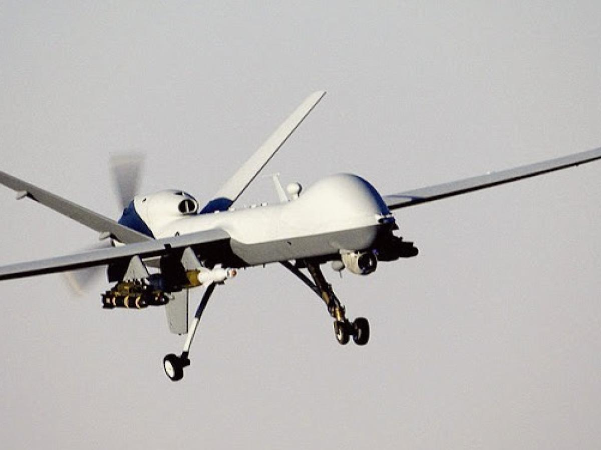

# La guerra cambió. El Estado sigue cazando nombres

Publicado en La Silla Vacía, Red de Expertos, 2026  
Autor: Manfred Grautoff  
URL: https://www.lasillavacia.com/red-de-expertos/red-de-la-paz/drones-en-la-guerra-en-colombia-el-estado-sigue-cazando-nombres/

---

A las cuatro de la mañana, en el Naya, despega un dron que no figura en ningún informe. No sale de un campamento. Sale de una escuela que no existe en los organigramas. Dionisio Rayo tomó antiguos explosivistas y muchachos criados entre consolas y pantallas y los convirtió en operadores letales. Hoy, sus drones ponen en jaque la operación Perseo en el norte del Cauca. No es ideología. Es ingeniería de guerra.

En la sala de crisis miran mapas de impactos y lo llaman análisis. Es el sesgo del superviviente. Perseguimos el humo y dejamos viva la fábrica del fuego. Si Kahneman, premio Nobel de Economía, estuviera en la mesa, señalaría los agujeros del fuselaje y diría lo obvio: estamos protegiendo el daño y dejando intacta la línea de producción de la guerra.

El mapa marca los impactos. El avión delata el error: sesgo del superviviente. Corremos detrás del daño y dejamos intacta la fábrica del ataque.
Colombia enfrenta una modernización del conflicto y un proceso de aprendizaje criminal que se expande desde enclaves rurales hacia territorios donde la economía ilegal es, en la práctica, el principal motor de actividad.

La guerra no solo persiste: se modernizó. La Fundación Ideas para la Paz (FIP) incorporó cifras del Análisis de Capacidades de la Amenaza del Departamento Conjunto de Inteligencia y Contrainteligencia de las Fuerzas Militares. Esos datos permiten ver con claridad la evolución de estas estructuras.

El cuadro es inequívoco: los combatientes ya superan los 27.000, los enfrentamientos entre grupos alcanzaron 115 en 2025, los ataques con drones llegaron a 277, el desplazamiento forzado creció 85% y más de un millón de personas viven hoy bajo confinamiento —un eufemismo para describir poblaciones sometidas al control armado—. Es la firma operativa de una transformación del conflicto. Y no es solo Colombia: es la misma lógica que hoy recorre de México al Medio Oriente, de Brasil a la Amazonía.

Mientras ellos innovan, el Estado reacciona. El tablero estratégico se inclina, en silencio, a favor de los grupos armados. No hay un plan que articule seguridad, justicia e inteligencia; hay respuestas fragmentadas, sin doctrina común ni sentido estratégico. Y todo esto ocurre mientras el debate público sigue tratando la seguridad como un problema de gasto, no de enfoque estratégico. En los territorios, el conflicto arrecia y eso se traduce en algo muy concreto: poblaciones dejadas a su suerte frente a estructuras que ya no solo ejercen violencia, sino gobierno. Ese desbalance empieza, además, a proyectarse hacia las ciudades, donde la violencia deja de ser periférica y vuelve a ser un problema central de seguridad, pero ya bajo una lógica de control armado.

Esa brecha no es abstracta: ya tiene manifestaciones operativas concretas. Los datos muestran el motor de esta degradación. En 2025, los secuestros pasaron de 279 a 651 casos: un aumento de 372 eventos en un solo año. A esto se suma la explosión del uso de drones —277 ataques, más del doble que en 2024— y el incremento de los enfrentamientos entre grupos armados. Es el mismo patrón: modernización del conflicto y aprendizaje criminal.

La firma de esta fase es doble: tecnología barata como multiplicador táctico y secuestro como instrumento de control social. Medirla solo por la tasa de homicidios ya no alcanza. El cambio real está en otra parte. Está en cómo se pelea. En el modus operandi.

Por eso importan más figuras como Dionisio Rayo y la escuela de drones del Naya que muchos jefes visibles. No porque manden más hombres, sino porque están inventando cómo se combate. Lo mismo pasa con la estructura de drones del ELN en Arauca. El dron no es un gadget. Es doctrina en acción.

Mientras los grupos armados convierten tecnología barata en ventaja estratégica, el Estado sigue sin un manual básico para que un pelotón sepa tomar medidas evasivas con escopetas Mossberg calibre 12 y hacer frente a un ataque con drones. Ese es el nuevo vector del conflicto. Y hoy lo están explotando ellos.

Con un indicador de gobernanza criminal construido para este análisis —un índice simple que cruza cuánto controlan, cuánto innovan y qué tan rápido cambian— dejamos de contar muertos y empezamos a medir quién manda. Tomamos los datos, miramos cuánto cambia cada frente del conflicto de un año a otro y cruzamos control, innovación y disputa; donde se acelera, el poder se concentra, y donde no, el nivel queda contenido: la frontera entre quien pelea y quien gobierna. No es casual: el sesgo del superviviente no es solo un error táctico, es un error de sistema.

Ese salto es doctrinal, no solo tecnológico. En pocos años, estas estructuras transformaron herramientas baratas en un sistema de coerción más sofisticado, capaz de combinar intimidación, castigo selectivo y demostración de poder. No es una simple adaptación táctica. Es una mutación en la forma de hacer la guerra. Y está ocurriendo más rápido de lo que el Estado parece dispuesto —o capaz— de comprender.

Hoy, mientras algunos siguen persiguiendo grandes nombres o intentando pelear la guerra del pasado, las verdaderas fábricas de poder están en otro lado: en las escuelas, en el entrenamiento, en la innovación, en cómo esas capacidades se filtran primero y se imponen después sobre la vida urbana y rural. Así se está escribiendo esta fase del conflicto. Y por eso no solo continúa: se vuelve cada vez más difícil de contener.

La pregunta es incómoda, pero inevitable. ¿Está el Estado dispuesto a aceptar que la guerra que enfrenta ya no es la misma? ¿O va a seguir reaccionando a la guerra de ayer mientras pierde, día a día, la de hoy?

Con los datos del Comando General de las Fuerzas Militares y de la FIP ya es posible ir más allá del diagnóstico y anticipar trayectorias. Ver qué pasa si las decisiones actuales se mantienen, si se hace más de lo mismo, o si se cambia de forma de actuar.

Si nada cambia, Colombia no estalla: se acostumbra. Con el ritmo reciente —23,5% anual entre 2022 y 2025, si se extrapola linealmente la tendencia observada en los datos— y sin un giro doctrinal de fondo, la capacidad agregada puede acercarse a los 80.000 hacia 2030. No es una explosión. Es peor: la normalización del control armado, el momento en que lo excepcional deja de sorprender y se vuelve paisaje.

Hay un segundo camino, más caro y más cómodo: poner más plata, mover más tropas, hacer lo mismo. Ir por cabecillas. Llegar tarde. Desplegar sin rediseñar. El crecimiento se frena, pero no se rompe. Se quedan por encima de los 40.000. El país entra en una rutina amarga: la seguridad se desgasta, la inversión duda, la gente se va, las cuentas públicas aprietan. No es derrota. Es cansancio. Y el cansancio también pierde guerras.

La única salida real exige algo menos popular y más difícil: pensar distinto. Ir a las finanzas criminales. Tocar la cadena de mando intermedia. Presionar el corazón de la organización. En ese camino, las estructuras podrían bajar hacia un orden cercano a los 20.000. Incluso así, no hay atajos. Haría falta tiempo, constancia y algo que hoy escasea: un acuerdo mínimo en que la seguridad no es de izquierda ni de derecha. Es del país.

En otras palabras, el problema ya no es cuántos hombres tienen, sino qué tan rápido aprenden y cómo convierten innovación barata en poder. Si el Estado no entiende esa secuencia —escuela, entrenamiento, innovación, expansión—, si Dionisio Rayo y otros como él siguen formando operadores mientras nosotros seguimos cazando nombres, las Fuerzas Militares seguirán corriendo detrás de sombras: objetivos de alto valor mediático y baja importancia estratégica, mientras se pierde lo único que decide esta guerra.

De ahí salen tres tareas. No son elegantes, son necesarias.

Primero, hay que arreglar el cerebro del sistema. Antes de comprar más armas, hay que volver a pensar. Mirar mejor. Conectar mejor. Anticipar. Sin eso, todo lo demás es ruido caro y tiempo regalado al enemigo. Segundo, hay que ir por el dinero. Hoy las finanzas criminales siguen siendo una caja negra. Sabemos que existen. No sabemos cómo mandan. Y lo que no se entiende, no se puede romper. Tercero, hay que cambiar la doctrina. Esta ya no es una guerra de frentes. Es control social. Es castigo selectivo. Es administración del miedo. En ese tablero, una escuela de entrenamiento pesa más que la captura de un nombre famoso.

La guerra ya cambió. El Estado, no. Y en esa distancia, los grupos armados no solo avanzan: compran tiempo. Y en esta guerra, el tiempo es lo único que no se puede recuperar.

# Arquitectura de la Guerra Irregular en Colombia
**Plataforma de Analítica Estratégica para Capacidades Militares Irregulares y Transformación del Conflicto en Colombia**

---

## Resumen Ejecutivo

Este repositorio alberga una **infraestructura de analítica estratégica** diseñada para analizar la evolución de capacidades militares irregulares, los procesos de adaptación organizacional y la transformación del conflicto armado en Colombia. Está construido sobre **datos verificados** de la **Fundación Ideas para la Paz (FIP)** y fuentes oficiales, incluyendo información publicada por el **Comando General de las Fuerzas Militares**.

El objetivo de este proyecto no es la descripción coyuntural. Es la **producción sistemática de inteligencia estratégica**: transformar datos operativos heterogéneos en **indicadores comparables, modelos de escenarios y productos analíticos útiles para la toma de decisiones**.

Esta infraestructura respalda el tipo de análisis publicado en espacios de debate estratégico como *La Silla Vacía* y está diseñada para escalar hacia informes de política pública, evaluaciones estratégicas y ejercicios de planeación por escenarios.

---

## Justificación Estratégica

El debate público sobre seguridad y conflicto suele estar dominado por:

- Narrativas centradas en eventos aislados  
- Interpretaciones tácticas de corto plazo  
- Indicadores fragmentados y no comparables  

Este pipeline responde a una carencia estructural: **la ausencia de marcos analíticos acumulativos, comparables en el tiempo y orientados a escenarios**.

En concreto, permite:

- Integrar **múltiples indicadores** en una arquitectura analítica coherente  
- Convertir bases de datos operativas en **paneles estratégicos longitudinales**  
- Medir **capacidades y adaptación organizacional**, no solo contar eventos  
- Traducir datos en:
  - Escenarios de crecimiento o contención de la amenaza  
  - Métricas de concentración y dispersión del riesgo  
  - Índices sintéticos de riesgo estratégico  
  - Diagnósticos sobre gobernanza, innovación y aprendizaje organizacional en estructuras armadas  

En otras palabras:

> Este marco está diseñado para apoyar evaluaciones estratégicas prospectivas, no solo descripciones retrospectivas.

---

## Gobernanza de Datos y Trazabilidad

El pipeline se construye sobre:

- Datos verificados de la **Fundación Ideas para la Paz (FIP)**  
- Fuentes oficiales del Estado colombiano  
- Publicaciones del **Comando General de las Fuerzas Militares**  
- Procesos completamente reproducibles de ingesta, transformación, modelado y visualización  

Cada salida (tablas, figuras, escenarios, índices) es **trazable** a:

- Un script específico  
- Una fuente de datos definida  
- Una decisión metodológica explícita  

Esto garantiza:

- Auditabilidad técnica  
- Reproducibilidad de resultados  
- Actualización sistemática de los diagnósticos estratégicos  

---

## Productos Analíticos

El repositorio soporta, entre otros:

- Modelos de escenarios sobre crecimiento y contención de capacidades irregulares  
- Análisis de concentración y fragmentación del poder organizacional armado  
- Índices compuestos de riesgo estratégico  
- Modelos de gobernanza y adaptación organizacional  
- Visualizaciones estratégicas para uso analítico de alto nivel  
- Respaldo empírico para columnas, informes y documentos de política pública  

---

## Publicaciones y Productos de Política Pública

Esta infraestructura respalda análisis publicados en medios de debate estratégico.

- **El giro de los drones en el conflicto colombiano** — *La Silla Vacía*, 2026  
  (enlace a añadir tras publicación)

A medida que se publiquen nuevos artículos, informes o notas de política, los datos y modelos subyacentes serán incorporados aquí para asegurar transparencia, reproducibilidad y acumulación de capacidad analítica.

---

## Estructura del Repositorio

- `scripts/` — Pipeline analítico (ingesta, transformación, modelos, visualización)  
- `data/` — Datos crudos, verificados y derivados  
- `outputs/` — Tablas, figuras y productos analíticos  
- `docs/` — Informes renderizados y notas técnicas  
- `checks/` — Validación de datos y control de calidad  
- `logs/` — Registros de ejecución  

---

## Posicionamiento Estratégico

Este proyecto opera en la intersección entre:

- Analítica de datos  
- Inteligencia estratégica  
- Economía del conflicto  
- Estudios de seguridad y defensa  
- Narrativa estratégica basada en evidencia  

Su propósito no es la visualización por sí misma.  
Es la **producción de insumos analíticos de calidad decisional**.

---

## Uso Público y Gobernanza del Proyecto

Este repositorio funciona como:

- Espina dorsal técnica de análisis estratégicos publicados  
- Archivo reproducible de productos analíticos  
- Plataforma de desarrollo para modelación prospectiva por escenarios  

Cada nuevo producto público tendrá aquí su respaldo empírico y metodológico correspondiente.

---

## Fuentes, trazabilidad y método (How this is sourced)

Este proyecto se construye sobre un principio central: **todo resultado debe ser trazable a datos verificables y a decisiones metodológicas explícitas**.

### Fuentes de datos

La infraestructura integra:

- Bases consolidadas y verificadas por la **Fundación Ideas para la Paz (FIP)**  
- Información pública de entidades del Estado colombiano, incluyendo el **Comando General de las Fuerzas Militares**  
- Registros administrativos y series de indicadores de seguridad, conflicto e impacto humanitario  

Estas fuentes se organizan en tres capas:

- `data/raw/` → Insumos originales  
- `data/verified/` → Datos depurados y validados (capa FIP / fuentes oficiales)  
- `data/derived/` → Paneles, variables e indicadores construidos por el pipeline  

### Trazabilidad analítica

Cada producto analítico (tablas, figuras, escenarios, índices):

- Está generado por un **script específico** en `scripts/`  
- Usa **una versión identificable de los datos** en `data/`  
- Responde a **supuestos metodológicos explícitos** documentados en el código  
- Puede ser **reproducido de extremo a extremo** ejecutando el pipeline completo  

Esto permite:

- Auditoría técnica independiente  
- Reproducción de resultados  
- Actualización sistemática cuando hay nuevos cortes de datos  
- Discusión sustantiva sobre supuestos, no solo sobre conclusiones  

### Qué hace diferente a esta arquitectura

A diferencia de enfoques centrados en eventos o conteos aislados, este pipeline:

- Construye **paneles comparables en el tiempo**  
- Modela **capacidades y adaptación organizacional**, no solo incidentes  
- Produce **escenarios prospectivos** y métricas de riesgo estratégico  
- Vincula datos, modelos y narrativa estratégica en una sola arquitectura reproducible  

